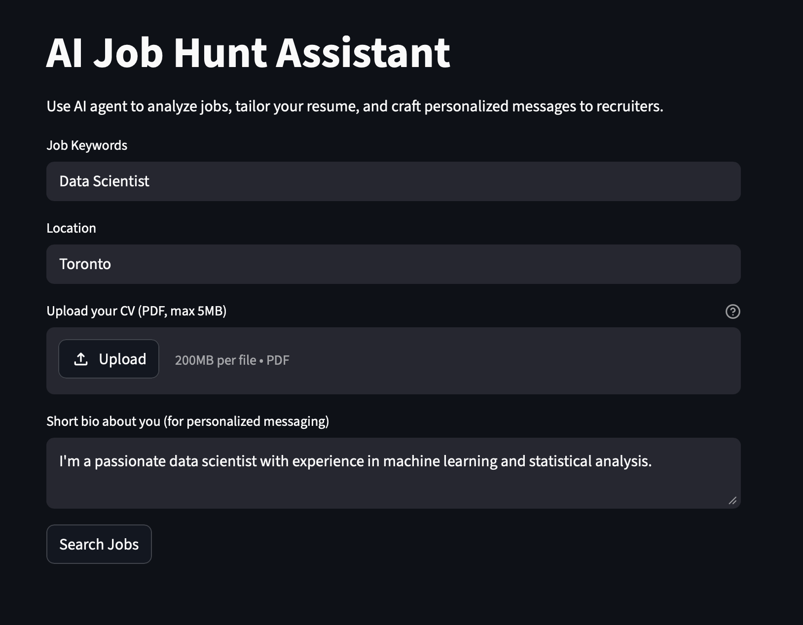

<div align="center">
  
</div>

## AI Job Hunt Assistant

An end-to-end agentic AI system designed to streamline the job search process. This project demonstrates a multi-agent workflow where three specialized AI agents collaborate to handle every stage of a job application — from discovery to outreach.

## Agents

| Agent | Responsibility |
|---|---|
| **Job Description Agent** | Searches and analyzes relevant job listings |
| **Messaging Agent** | Crafts personalized outreach messages for each opportunity |
| **Resume Agent** | Builds a tailored resume and cover letter for a selected role |

## Built With
- **[CrewAI](https://crewai.com)** — Agent orchestration and workflow management
- **[OpenAI API](https://openai.com)** — Large language model powering all agents
- **[JSearch via RapidAPI](https://rapidapi.com/letscrape-6bRBa3QguO5/api/jsearch/playground)** — Job search data source

## Getting Started

### 1. Configure API Keys

Copy the example environment file and fill in your credentials:
```bash
cp backend/utils/.env.example backend/utils/.env
```

You will need the following API keys:
- **OpenAI API Key** — Sign up at [platform.openai.com](https://platform.openai.com)
- **JSearch API Key** — Create a free account at [RapidAPI](https://rapidapi.com) and subscribe to the [JSearch API](https://rapidapi.com/letscrape-6bRBa3QguO5/api/jsearch/playground)

Refer to `.env.example` for the full list of required variables.

---

### 2. Install Backend Dependencies

This project uses [uv](https://github.com/astral-sh/uv) as the package manager. Install it if you haven't already:
```bash
curl -LsSf https://astral.sh/uv/install.sh | sh
```

Then create and sync the backend environment:
```bash
cd backend
uv venv .venv
uv sync
source .venv/bin/activate
```

---

### 3. Run the Application

```bash
cd backend
uv run -m streamlit run ../frontend/streamlit_app.py
```

The app will be available at `http://localhost:8501` by default.

---

## Project Structure

```text
job-hunt-assistant/
├── backend/                    # Independent Python package
│   ├── pyproject.toml          # Backend package config
│   ├── uv.lock                 # Backend lock file
│   ├── .python-version         # Backend Python version
│   ├── .venv/                  # Backend virtual environment
│   ├── tests/                  # Backend tests
│   ├── agents/
│   ├── apis/
│   ├── utils/
│   └── data/
├── frontend/
│   └── streamlit_app.py        # Streamlit UI
└── .github/workflows/ci.yaml   # CI runs backend checks/tests
```

## Development Commands

From the `backend` directory:

```bash
# run tests
pytest tests/

# lint/format/security
ruff check .
black --check .
bandit -c pyproject.toml -r .
```


